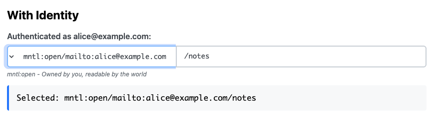

# mntl-space-fab

A standalone web component for selecting MMM mental space graphs (mntl: URN picker).




## Features

- 🎯 **Mental space type selection** - Choose mntl:open, mntl:publ, etc.
- 📝 **Path input** - Hierarchical path within mental space
- 🔒 **Configurable types** - Inject only the mental space types you support
- 🎨 **Identity-aware labels** - Shows {identity} in dropdown labels
- 📖 **Descriptive hints** - Explains each mental space type
- ✨ **Event-driven** - Emits graph-changed events
- 🎯 **Unified look** - Select and input boxes seamlessly joined
- ✅ **Smart validation** - Enforces leading slash, disables types requiring identity when not logged in

## Installation

### For Development (using npm link)

```bash
# In ~/REPOS/mntl-space-fab
npm install
npm link

# In your consuming project (e.g., quad-form, ttl-editor-form)
npm link @mmmlib/mntl-space-fab
```

### For Production (using GitHub)

Add to your package.json:

```json
{
  "dependencies": {
    "@mmmlib/mntl-space-fab": "github:smurp/mntl-space-fab#main"
  }
}
```

Then:

```bash
npm install
```

## Usage

### Basic Usage

```html
<script type="module" src="path/to/mntl-space-fab.js"></script>
<mntl-space-fab></mntl-space-fab>
```

### With Configuration

```javascript
const fab = document.querySelector('mntl-space-fab');

// Set current user identity
fab.currentIdentity = 'mailto:alice@example.com';

// Set initial value
fab.value = 'mntl:open/alice/notes';

// Restrict to only supported types (security consideration)
fab.acceptedTypes = [
  { value: 'mntl:open', label: 'mntl:open/{identity}', 
    description: 'mntl:open - Owned by you, readable by the world' },
  { value: 'mntl:publ', label: 'mntl:publ', 
    description: 'mntl:publ - A true public commons' }
];

// Listen for changes
fab.addEventListener('graph-changed', (e) => {
  console.log('Graph changed:', e.detail);
  // { mentalSpace: 'mntl:open', path: '/alice/notes', fullUri: 'mntl:open/alice/notes' }
});
```

### Integration with Forms

```html
<form>
  <label>Select Graph:</label>
  <mntl-space-fab id="graph-selector"></mntl-space-fab>
  <button type="submit">Submit</button>
</form>

<script type="module">
  const fab = document.getElementById('graph-selector');
  
  document.querySelector('form').addEventListener('submit', (e) => {
    e.preventDefault();
    console.log('Selected graph:', fab.value);
  });
</script>
```

## API Reference

### Properties

- **`currentIdentity`** - User identity string (interpolated into labels)
- **`value`** - Full graph URI (get/set)
- **`mentalSpace`** - Current mental space type (e.g., 'mntl:publ')
- **`path`** - Current path within mental space (e.g., '/science')
- **`acceptedTypes`** - Array of mental space type definitions

### Mental Space Type Format

```javascript
{
  value: 'mntl:publ',           // URN prefix
  label: 'mntl:publ',            // Display label (can include {identity})
  description: 'A true public commons'  // Help text
}
```

### Default Accepted Types

By default, only these types are enabled (due to security considerations):

```javascript
[
  { value: 'mntl:open', label: 'mntl:open/{identity}',
    description: 'mntl:open - Owned by you, readable by the world' },
  { value: 'mntl:publ', label: 'mntl:publ',
    description: 'mntl:publ - A true public commons' }
]
```

### Methods

- **`getValue()`** - Returns full graph URI
- **`setValue(uri)`** - Sets graph URI (parses mental space and path)

### Events

- **`graph-changed`** - Fired when graph selection changes
  - `detail: { mentalSpace, path, fullUri }`

## URI Format

### When identity exists (e.g., 'mailto:alice@example.com'):

- **mntl:open** → `mntl:open/mailto:alice@example.com/path`
- **mntl:publ** → `mntl:publ/path`

### When identity is null:

- **mntl:open** → Disabled (grayed out, cannot select)
- **mntl:publ** → `mntl:publ/path` (available)

### Path Rules:

- Always starts with `/` (auto-added if user types without it)
- Normalized on blur
- Placeholder shows `/path`

## Security Considerations

Types that require identity (like `mntl:open`, `mntl:gate`) are automatically:
- **Disabled** when `currentIdentity` is `null`
- **Auto-switched** to `mntl:publ` if currently selected and identity becomes `null`
- Shown as grayed out and italic in the dropdown

This prevents invalid URIs like `mntl:open/notes` (missing identity).

## Styling

The component uses Shadow DOM with a unified look:
- Select and input boxes seamlessly joined (no gap)
- Select is right-aligned for better visual flow
- Both fields share a single focus outline
- Description text updates based on selection

## Development

```bash
cd ~/REPOS/mntl-space-fab
npm run dev
# Visit http://localhost:8003/example/
```

## License

AGPL-3.0-or-later